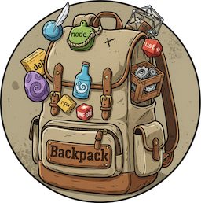

<h1 align="center"></h1>

:warning: Warning: This project is still under heavy development, to be considered a beta, at best.

Backpack is used to collect and store a varied and large amounts of artifacts, for example npm, nuget...

Primary use-case is transferring to airgapped / high security networks for offline consumption via an artifact repository.

The complex keeps track of already collected artifacts, dependencies, and versions.

The Backpack's collection of artifacts is greedy, it will by default collect every version and every dependency version, recursively, 
until every item is collected, artifact filters can be applied to reduce the amount collected.

It builds daily deltas to reduce the day-to-day load on the transfer device.

The design is microservice oriented and intended to minimize the amount of work needed to build a new "Processor", for example maven.

Processors can safely rely on the core infrastructure of Backpack, the core infrastructure handles the memorization of metadata, 
and the collection via standard protocols, for example http, git, or docker.
## Deploy
An early stage helm chart is available at
https://github.com/linus-berg/helm-charts/tree/main/charts/backpack

https://linus-berg.github.io/helm-charts/

See the `values.examples.yaml` file for configuration.
The auxiliary services such as mongodb still needs to be provided by the administrator.

## Recommended minimum requirements (single node)
| Resource | Req                              |
|----------|----------------------------------|
| RAM      | 16GB                             |
| CPU      | 8 cores                          |
| Storage  | 2TB * APM (depending on usage)   |
| Network  | >= 1 Gbps                        |

Backpack is designed to be horizontally scalable and suitable for kubernetes, however, kubernetes deployments have not been tested thoroughly.

The following services are required to run the complete suite of Backpack capabilities.
A batteries included starter pack is included under /examples and /Compose, however, these are not production ready configurations, and are only intended as an development/test environment.

| Service                 | Requirement                            |
|-------------------------|--------------------------------------|
| Keycloak                | Required (only for API and GUI)        |
| RabbitMq                | Required                               |
| Minio                   | Required                               |
| MongoDb                 | Required                               |
| Redis                   | Required                               |
| Container Registry      | Required (only for ACM.Container)      |
| OpenTelemetry Collector | Recommended but required for Telemetry | 
| Grafana                 | Recommended                            | 
| Prometheus              | Recommended                            | 
| Tempo                   | Recommended                            | 

## Modules
| Tag       | Name                        | Description                                                           |
|-----------|-----------------------------|-----------------------------------------------------------------------|
| Tracker   | Artifact Tracking Module    | Handles the tracking of artifacts to request an update by the APC.    |
| Processor | Artifact Processing Module  | Handles the processing of a defined artifact-type.                    |
| Collector | Artifact Collector Module   | Handles the collection of artifact-types based on standard protocols. |

## Environment Variables
| Name                            | Default   | Modules               |
|---------------------------------|-----------|-----------------------|
| BP_OTEL_HOST                    | -         | Ingest, API, APM, ACM |
| BP_RABBIT_MQ_HOST               | localhost | Ingest, API, APM, ACM |
| BP_RABBIT_MQ_USER               | guest     | Ingest, API, APM, ACM |
| BP_RABBIT_MQ_PASS               | guest     | Ingest, API, APM, ACM |
| BP_REDIS_HOST                   | localhost | Ingest, API           |
| BP_REDIS_USER                   | -         | Ingest, API           |
| BP_REDIS_PASS                   | -         | Ingest, API           |
| BP_MONGO_STR                    | -         | Ingest, API           |
| BP_API_HOST                     | localhost | GUI, ATM, API         |
| BP_API_PORT                     | 4000      | GUI, ATM, API         |
| BP_S3_ACCESS_KEY                | -         | ACM                   |
| BP_S3_SECRET_KEY                | -         | ACM                   |
| BP_S3_REGION                    | -         | ACM                   |
| BP_S3_ENDPOINT                  | -         | ACM                   |
| BP_S3_BUCKET                    | -         | ACM                   |
| BP_COLLECTOR_DIRECTORY          | /data/    | ACM.Git               |
| BP_COLLECTOR_HTTP_DELTA         | true      | ACM.Http              |
| BP_COLLECTOR_HTTP_MODE          | lake      | ACM.Http              |
| BP_COLLECTOR_CONTAINER_REGISTRY | -         | ACM.Container         |
